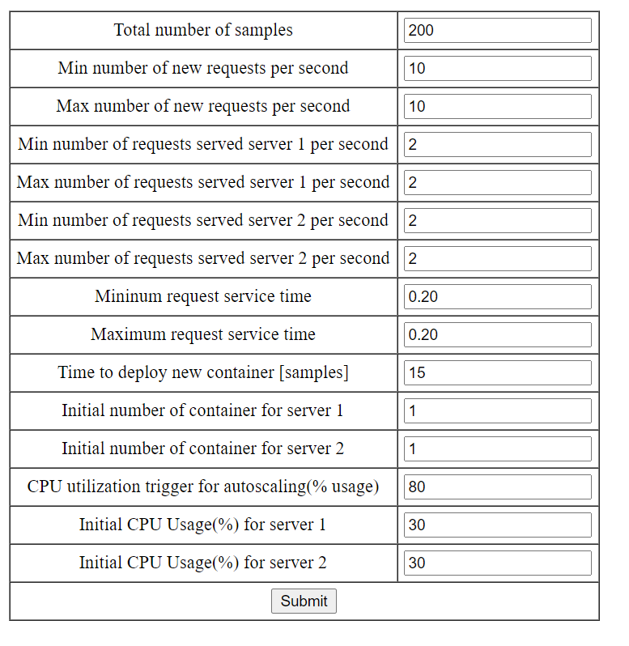

# LOR-simulation
LOR simulation repository

This repository contains the code to create simulations and data related to container autoscaling. 
The algorithm used for autoscaling triggers the container level autoscaling whenever cpu utilization goes above 80%
Every time the autoscaling is triggered, the number of containers is recalculated using the following formula -

## FORMULA 

This is based on HPA algorithm used by kubernetes- 

> number of containers = current_number_of_containers * current_cpu_utilization / target_cpu_utilization 

## INPUT
The initial values it uses are as below -

## OUTPUT

It produces two csv files for server 1 and server 2 respectively. These files contains different parameters such as , number of containers, cpu utilization, response time, incoming or outgoing request, etc. One can perform multiple operations on these datasets and create necessary plots by tweaking the scripts.

## DEMO

To try it yourself, visit -

https://nicolafiorello.it/WORKS/resmet-datagen/index2.php

